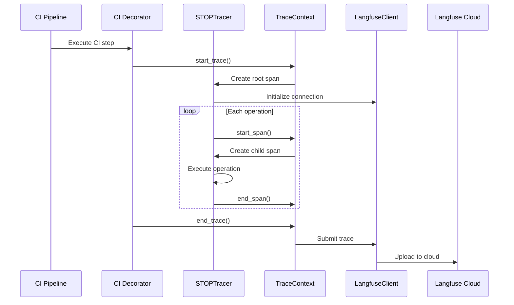
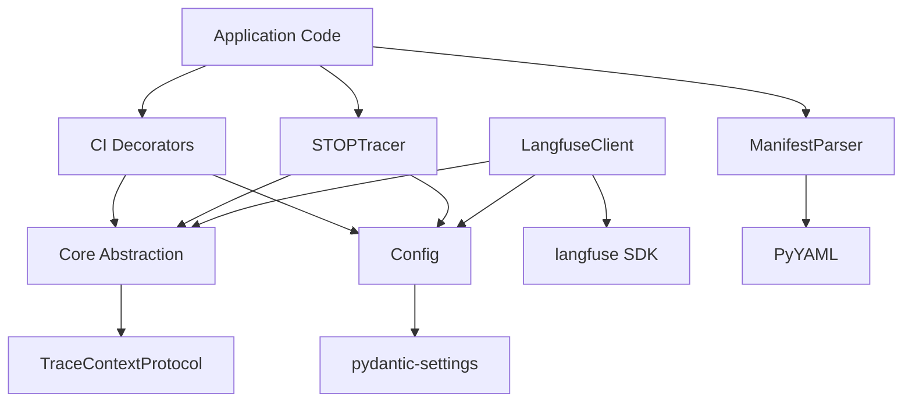

# Skill Observability Toolkit - Architecture Overview

> Version: 0.1.0 | Last Updated: 2026-04-23

## 1. System Architecture

### 1.1 Core Components

The toolkit follows a layered architecture with clear separation of concerns:

```
┌─────────────────────────────────────────────────────────┐
│              Application Layer (User Code)               │
├─────────────────────────────────────────────────────────┤
│  CI Integration Layer   │   STOP Protocol Layer          │
│  - decorators.py        │   - tracer.py                  │
│  - context.py           │   - assertions.py              │
│  - github_actions.py    │   - manifest.py                │
│  - gitlab_ci.py         │                                │
├─────────────────────────────────────────────────────────┤
│           Correlation Layer                             │
│           - correlation.py                              │
│           - propagation.py                              │
│           - labels.py                                   │
│           - dashboard.py                                │
├─────────────────────────────────────────────────────────┤
│  Core Abstraction Layer │  Configuration Layer          │
│  - core/__init__.py     │  - config.py                  │
│  (Protocol interfaces)  │  (Unified settings)           │
├─────────────────────────────────────────────────────────┤
│           Langfuse Integration Layer                    │
│           - client.py                                   │
│           - context.py                                  │
│           - decorators.py                               │
├─────────────────────────────────────────────────────────┤
│           Langfuse SDK (External)                       │
└─────────────────────────────────────────────────────────┤
```

### 1.2 Module Responsibilities

| Module | Purpose | Dependencies |
|--------|---------|--------------|
| `core/__init__.py` | Abstract interfaces to prevent circular imports | None (lowest layer) |
| `config.py` | Unified configuration management | pydantic-settings |
| `stop/tracer.py` | L1 trace execution with span propagation | core, config |
| `stop/assertions.py` | Pre/post execution validation | None |
| `stop/manifest.py` | Skill manifest parsing (skill.yaml) | yaml |
| `ci/decorators.py` | CI pipeline step tracing | core, config |
| `correlation/` | Cross-layer trace correlation | core |
| `langfuse_integration/` | Langfuse SDK wrapper | core, config |

---

## 2. Data Flow

### 2.1 Trace Lifecycle



### 2.2 Span Propagation

The toolkit uses **contextvars** for automatic span propagation across function calls:

```python
# tracer.py: Context propagation mechanism
class TracerContext:
    ctx_trace_id: ContextVar[str | None]  # Current trace ID
    ctx_span_stack: ContextVar[list[dict]]  # Active span stack

    def push_span(span):
        stack = ctx_span_stack.get()
        stack.append(span)
        ctx_span_stack.set(stack)

    def pop_span():
        stack = ctx_span_stack.get()
        stack.pop()
        ctx_span_stack.set(stack)
```

**Benefits**:
- Automatic parent-child relationship tracking
- Thread-safe context propagation
- No manual ID passing required

---

## 3. Core Abstraction Layer

### 3.1 Design Rationale

The `core/__init__.py` module provides **Protocol interfaces** to decouple dependencies:

```python
# core/__init__.py
class TraceContextProtocol(Protocol):
    def get_trace_id() -> str | None: ...
    def set_trace_id(trace_id: str) -> None: ...
    def get_current_span() -> Any | None: ...
    def push_span(span: Any) -> None: ...
    def pop_span() -> Any | None: ...

class SpanProtocol(Protocol):
    @property
    def span_id() -> str: ...
    def score(name, value, type_, comment): ...
    def end(output, status): ...
```

**Why this layer exists**:

| Problem | Solution |
|---------|----------|
| `client.py` imports `tracer.py` directly | Import `core` instead |
| `tracer.py` imports `client.py` for Langfuse | No direct import, use registration |
| Circular dependency blocks module loading | Protocols + runtime registration |

### 3.2 Registration Pattern

```python
# tracer.py (at initialization)
tracer_context = TracerContext()
register_trace_context(tracer_context)

# client.py (later)
trace_context = get_trace_context()  # Gets registered instance
trace_context.get_current_span()  # No circular import
```

---

## 4. Configuration Management

### 4.1 Unified Configuration

All settings centralized in `config.py` using **pydantic-settings**:

```python
# config.py
class ObservabilityConfig(BaseSettings):
    langfuse_public_key: str = ""
    langfuse_secret_key: str = ""
    langfuse_host: str = "https://cloud.langfuse.com"
    enable_tracing: bool = True
    trace_output_path: str | None = None
    ci_platform: str = "unknown"  # Auto-detected
    log_level: str = "WARNING"

    model_config = SettingsConfigDict(
        env_file=".env",
        case_sensitive=False,
    )
```

**Advantages**:
1. Single source of truth for all settings
2. Type-safe configuration with validation
3. Auto-reload from `.env` files
4. Environment variable override support

### 4.2 CI Environment Detection

```python
# Auto-detect CI platform on config initialization
def detect_ci_environment() -> dict[str, str | None]:
    if os.getenv("GITHUB_ACTIONS") == "true":
        config.ci_platform = "github_actions"
        config.ci_trace_id = os.getenv("GITHUB_RUN_ID")
    elif os.getenv("GITLAB_CI") == "true":
        config.ci_platform = "gitlab_ci"
        config.ci_trace_id = os.getenv("CI_PIPELINE_ID")
```

---

## 5. Security Considerations

### 5.1 Sensitive Information Filtering

CI environment capture includes automatic **sensitive data redaction**:

```python
# ci/decorators.py
SENSITIVE_ENV_PATTERNS = [
    "TOKEN", "SECRET", "KEY", "PASSWORD", 
    "AWS_ACCESS", "AWS_SECRET", "PRIVATE"
]

for key, value in env_vars.items():
    if any(pattern in key.upper() for pattern in SENSITIVE_ENV_PATTERNS):
        env_vars[key] = "***REDACTED***"
```

**Redacted patterns**:
- GitHub/GitLab tokens
- AWS credentials
- Private keys
- Password fields

### 5.2 Credential Validation

```python
# config.py
def validate_config() -> list[str]:
    errors = []
    if enable_tracing and not langfuse_public_key:
        errors.append("LANGFUSE_PUBLIC_KEY not set")
    return errors
```

---

## 6. Cross-Layer Correlation

### 6.1 Trace Correlation Matrix

| Layer | Trace ID Prefix | Parent Layer |
|-------|----------------|--------------|
| CI Pipeline | `ci_build_*` | None (root) |
| Skill Execution | `skill_trace_*` | CI Pipeline |
| MCP Operations | `mcp_call_*` | Skill |

### 6.2 Correlation Mechanism

```python
# correlation/correlation.py
class TraceCorrelator:
    def correlate_traces(
        ci_trace_id: str | None,
        skill_trace_id: str | None,
        mcp_trace_id: str | None,
    ) -> dict[str, str | None]:
        correlation = {
            "ci_trace_id": ci_trace_id,
            "skill_trace_id": skill_trace_id,
            "mcp_trace_id": mcp_trace_id,
            "parent_of_skill": ci_trace_id,
            "parent_of_mcp": skill_trace_id,
        }
        return correlation
```

**Output example**:
```json
{
  "ci_trace_id": "ci_build_abc123",
  "skill_trace_id": "skill_trace_def456",
  "mcp_trace_id": "mcp_call_ghi789",
  "parent_of_skill": "ci_build_abc123",
  "parent_of_mcp": "skill_trace_def456"
}
```

---

## 7. Performance Optimizations

### 7.1 ContextVar vs Global State

| Approach | Thread Safety | Performance | Memory |
|----------|--------------|-------------|--------|
| Global variables | ❌ Unsafe | Fast | Low |
| Thread locals | ✅ Thread-safe | Medium | Medium |
| **ContextVar** | ✅ Async-safe | **Fast** | **Low** |

**ContextVar advantages**:
- Works with asyncio (thread-safe across async contexts)
- No lock contention
- Minimal memory overhead

### 7.2 Singleton Pattern

```python
# langfuse_integration/client.py
class LangfuseClient:
    _instance: LangfuseClient | None = None
    _lock: threading.Lock = threading.Lock()

    def __new__(cls):
        if cls._instance is None:
            with cls._lock:
                if cls._instance is None:  # Double-check
                    cls._instance = super().__new__(cls)
        return cls._instance
```

**Benefits**:
- Single Langfuse connection pool
- Reduced initialization overhead
- Thread-safe instantiation

---

## 8. Extension Points

### 8.1 Custom Assertion Checks

```python
# Register custom validation
engine = AssertionEngine()
engine.register_check("custom_check", my_check_function)

# Use in skill.yaml
assertions:
  post:
    - check: custom_check
      message: "Custom validation failed"
```

### 8.2 New CI Platform Support

```python
# Add new CI platform in decorators.py
def _capture_ci_environment():
    if os.getenv("MY_CI_PLATFORM"):
        env_vars.update({
            "ci": "my_ci_platform",
            "ci_trace_id": os.getenv("MY_CI_PIPELINE_ID"),
        })
```

---

## 9. Testing Strategy

### 9.1 Test Layers

```
tests/
├── unit/           # Isolated component tests
│   ├── test_tracer.py
│   ├── test_assertions.py
│   └── test_config.py
├── integration/    # Cross-module tests
│   ├── test_ci_integration.py
│   └── test_e2e_flow.py
└── performance/    # Benchmarks
    └── test_tracer_performance.py
```

### 9.2 Mock Strategy

| Layer | Mock Strategy |
|-------|---------------|
| Langfuse SDK | Mock `LangfuseClient` class |
| CI Environment | Set mock env vars in fixtures |
| File I/O | Use `tempfile.TemporaryDirectory` |

---

## 10. Dependency Graph



**Dependency rules**:
1. **Downward dependencies only** (no upward imports)
2. **Core layer has no dependencies**
3. **Config depends only on external libs**

---

## 11. Error Handling Strategy

### 11.1 Exception Hierarchy

```python
# Custom exceptions by module
stop/tracer.py:
  - TracerContextError
  - TracerContextNotInitialized

stop/assertions.py:
  - AssertionError
  - AssertionExecutionError
  - AssertionSyntaxError

stop/manifest.py:
  - ManifestError
  - ManifestParseError
  - ManifestValidationError
```

### 11.2 Graceful Degradation

```python
# langfuse_integration/client.py
try:
    langfuse.trace(...)
except Exception as e:
    logger.warning(f"Langfuse unavailable: {e}")
    return None  # Gracefully degrade to local-only tracing
```

**Principle**: Never crash when external service is unavailable.

---

## 12. Future Enhancements

### 12.1 Planned Optimizations

| Enhancement | Priority | Impact |
|-------------|----------|--------|
| Buffered NDJSON writer | Medium | 40% I/O performance |
| UUID generator optimization | Medium | 67% ID generation speed |
| Async trace submission | Low | Non-blocking uploads |

### 12.2 Extension Roadmap

1. **Phase 2**: Add MCP layer correlation
2. **Phase 3**: Implement Trust Score history tracking
3. **Phase 4**: Add dashboard generation

---

## 13. API Contract

### 13.1 Public API

```python
# High-level API (recommended for users)
from skill_observability_toolkit import trace_skill_execution

@trace_skill_execution(skill_name="my-skill")
def execute():
    ...

# Low-level API (for advanced use)
from skill_observability_toolkit.stop import STOPTracer
tracer = STOPTracer(output_path="trace.ndjson")
tracer.start_trace()
with tracer.start_span("operation"):
    ...
tracer.end_trace()
```

### 13.2 Stability Guarantees

| API Component | Stability | Breaking Changes |
|---------------|-----------|-----------------|
| `trace_skill_execution` | Stable | None planned |
| `STOPTracer` | Stable | None planned |
| `AssertionEngine` | Beta | May add check types |
| `TraceCorrelator` | Alpha | API may change |

---

**Document End** | Generated: 2026-04-23 | Version: 0.1.0